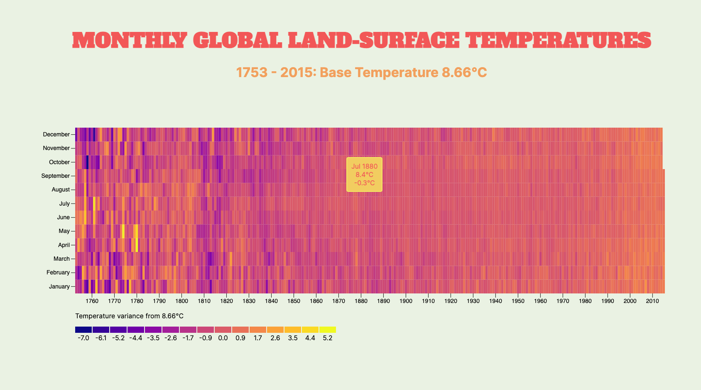

# D3 data visualisation of monhtly global land surface temperatures
## 1753 - 2015

This is exactly what it says on the tin.

Created as part of the [FreeCodeCamp](https://www.freecodecamp.org) D3 challenges.